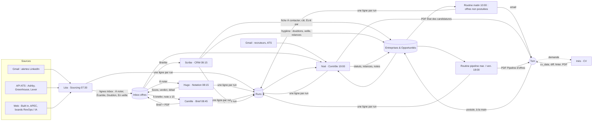

# Architecture v3 — six agents, deux routines, trois bases

*07/09/2026. Remplace la spec v2 du 17/08 (cinq agents dans un prompt). Ce document décrit ce qui est
construit dans ce dépôt et dans Notion, pas une intention.*

## Le principe

Un pipeline commercial, pas un chat. Chaque offre traverse des **étapes** matérialisées dans une base Notion
(« Inbox offres »), chaque agent ne fait avancer une ligne que d'une étape, et chaque passage laisse une trace
(champ `Run …`). Si un agent ne tourne pas, les lignes restent à leur étape : rien ne se perd, et l'agent de
contrôle le voit le soir même (`inbox_bloquee`). C'est la différence structurelle avec la v1, où trois rôles
vivaient dans une seule session de modèle et où une offre oubliée n'existait nulle part.

## Les trois bases Notion

| Base | Rôle | Qui écrit |
|---|---|---|
| **Inbox offres** (`ffb5a480-…`) | Zone de transit : une ligne par offre vue, quelle que soit la décision. Étape, clé, séniorité, activité vérifiée, note, verdict, brief, décisions de Tom en calibration. Le contenu de la page est l'annonce intégrale. | Léa (création), Hugo, Camille, Scribe (chacun ses champs) |
| **Entreprises & Opportunités** (`771278b1-…`) | Le CRM : seulement les offres à 15 et plus, briefées, et les dossiers en cours. Nouvelles propriétés : `Clé`, `Écrit par`, `Run`, `Vérifié actif le`, `Lien Inbox`, `Effectif`. | Scribe (création, hygiène), Noé (statuts), Routine matin (veille sur lien mort), Tom |
| **Runs** (`46327056-…`) | Journal d'exécution : agent, mode, lues, écrites, écartées, erreurs, contrôles. | Tous, à chaque run, même en échec |
| **Paramètres système** (`9ffa448c-…`) | Interrupteurs : Mode (pause / calibration / production), plafonds, seuils, identifiants des bases, dépôt de code. | Tom |

## Les agents et leur unique effet de bord

| Agent | Horaire (Paris) | Lit | Écrit | Ne fait jamais |
|---|---|---|---|---|
| **Léa** · sourcing | 07:30 lun–sam | Gmail (alertes), API ATS, web, CRM et Inbox (clés) | crée des lignes Inbox (≤ plafond) | noter, écrire dans le CRM, modifier une ligne |
| **Hugo** · notation | 08:15 lun–sam | Inbox « À noter », contenu de la page, CRM (dossier ouvert) | champs de notation de la ligne Inbox | sourcer, briefer, écrire dans le CRM, malus |
| **Camille** · brief | 08:45 lun–sam | Inbox « À briefer », web | Brief, Brief PDF, Étape « Briefée » | noter, estimer, écrire dans le CRM |
| **Scribe** · CRM | 09:15 lun–sam | Inbox « Briefée », CRM complet | fiches CRM depuis Briefée ; corrections d'hygiène de la liste fermée | créer sans brief, reculer un statut, supprimer, email |
| **Noé** · contrôle | 19:00 tous les jours | Gmail (4 j), CRM, Inbox, Runs | Statut / dates / Notes sur fiches existantes ; un email à Tom | créer une fiche (il la propose), écrire à un tiers |
| **Inès** · CV | à la demande | annonce, référence, règles CV, CRM (dossier ouvert) | fichier cv_data, PDF, diff, rapport du linter | envoyer, inventer, changer la maquette |
| Routine matin | 10:00 tous les jours | CRM « À contacter » ≥ 15 | veille sur lien mort ; un email | présenter une offre comme active sans preuve du script |
| Routine pipeline | 18:00 mar. et ven. | CRM, Inbox, Runs | un email avec PDF | modifier une fiche |

## Ce qui est décidé par du code, jamais par le modèle

Voir `docs/determinisme.md`. En résumé : la clé métier, la bande de séniorité, l'activité d'un lien, le
doublon, la validité de toute écriture (schémas), le classement d'un email de recrutement, la précédence
des statuts, les dates de relance, les contrôles d'hygiène, les rapports. Le modèle garde ce qui demande un
jugement : lire une annonce, cartographier les exigences vers des preuves, écrire un brief, adapter une accroche.

## Modes

`pause` : personne n'écrit. `calibration` : Léa propose 20 offres, Hugo les note, Tom décide et corrige, rien
n'atteint le CRM (voir `docs/calibration.md`). `production` : chaîne complète. Le mode se change dans Notion,
pas dans les prompts.

## Migration vers Dust

Chaque agent devient un agent Dust avec un trigger, la base Inbox reste la zone de transit, les règles
deviennent des skills, les scripts tournent dans la skill Computer ou restent externes. Voir
`docs/migration-dust.md`.
